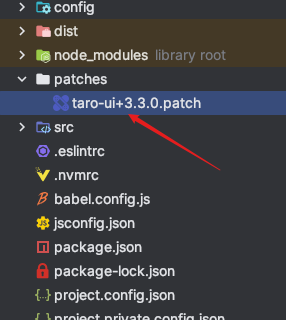

# patch-package


## 一、背景

起初是发现有一天`npm install` 之后项目突然跑不起来了，就开始了排查之旅。排查到最后发现`taro-ui`按需引入`toast`样式文件后，文件对比之前突然多了一行代码。修改`node_modules`中源代码后项目就可以正常启动了。


随后我就跑去`github`给`taro-ui`提issue，第二天被告知维护者已经给`taro`提了pr，但是对于我这个版本没有效果（这里后来没问出原因），他说可以用`patch`的方式去先暂时把源码改掉。


这时，我才发现一个新工具 `patch-package`

#### 作用

> lets app authors instantly make and keep fixes to npm dependencies. It's a vital band-aid for those of us living on the bleeding edge.

这是npm官网上对patch-package的说明，意思就是*允许应用程序作者立即对NPM依赖项进行修复。对于前端来说，这是一个至关重要的补丁。* 也就是说可以让大家对node_modules进行立即更改。


## 二、使用 


#### 1. 安装 

```shell
npm i patch-package
```

如果你不需要在生产中运行

```sh
npm i patch-package --save-dev
```


yarn、pnpm、docker安装命令可查看其 [git官网。](https://link.zhihu.com/?target=https%3A//github.com/ds300/patch-package)


#### 2. 修改npm包

更改node_modules 文件夹中要修改依赖包的文件


#### 3. 生成补丁文件

```sh
npx patch-package package-name(修改包名)
```


会自动在项目中生成一个patches文件夹，并放置了修改文件的patch文件




内容如下

```
diff --git a/node_modules/taro-ui/dist/style/components/toast.scss b/node_modules/taro-ui/dist/style/components/toast.scss
index f53d1ec..6163d14 100644
--- a/node_modules/taro-ui/dist/style/components/toast.scss
+++ b/node_modules/taro-ui/dist/style/components/toast.scss
@@ -1,4 +1,3 @@
-@use "sass:math";
 @import '../variables/default.scss';
 @import '../mixins/index.scss';
```


#### 4. 添加自动执行命令

In package.json

```json
 "scripts": {
   ...
    "postinstall": "patch-package"
 }
```


#### 5. 重新安装node_modules依赖

至此已完成，重新删除node_modules后执行 `npm install` 会发现代码已经是修改过后的。


#### 6.patch文件是什么?

其实就是一些`git diff`记录描述。

**原理**: patch-package会将当前 node_modules下的源码与原始源码进行 git diff，并在项目根目录下生成一个`patch`补丁文件。


#### 7.patch-package 的好处

##### 版本预检

当依赖项发生更改时，会以红色大写字母通知，需要检查所做修复是否仍然有效。npx patch-package 会直接报错**ERROR** Failed to apply patch for package xxxx at path，通过提示可以更方便定位问题。

##### 节省空间

无需拷贝一份源码，使用git diff来记录补丁更节省空间，安全又便捷。

##### 可审查

补丁可以作为正常审查过程的一部分进行审查。

## 三、其他方法

1. 给第三方库提issue等待维护人员修复
2. 给依赖包提pr自定修复并等待发布
3. 整体copy项目
   1. 直接引用法 （直接copy依赖包的源码，本地引用，不再通过npm包方式引用）
   2. 发布私库法（适合多项目中使用同一个依赖包的场景，可以把修改后的源码发布到私有的仓库上 ）
4. 修改引用法

   配置一个webpack alias别名，如'原始文件的引用路径': '修改后文件的引用路径'，使得最终修改后的文件被引用，如：
```js
resolve: {
  alias: {
    'pdfjs': path.resolve(__dirname, './patched/pdfjs/*'),
  }
} 
```

以上方法均有弊端：

前两种修复周期很长且依赖第三方，修复时间不定，不适合解决当前问题。

后几种方法都比较复杂，并且会导致项目臃肿，更容易忘记自己修改了源码的哪个部分，而且更新麻烦，每次都需要手动去更新代码，无法与插件同步更新。

